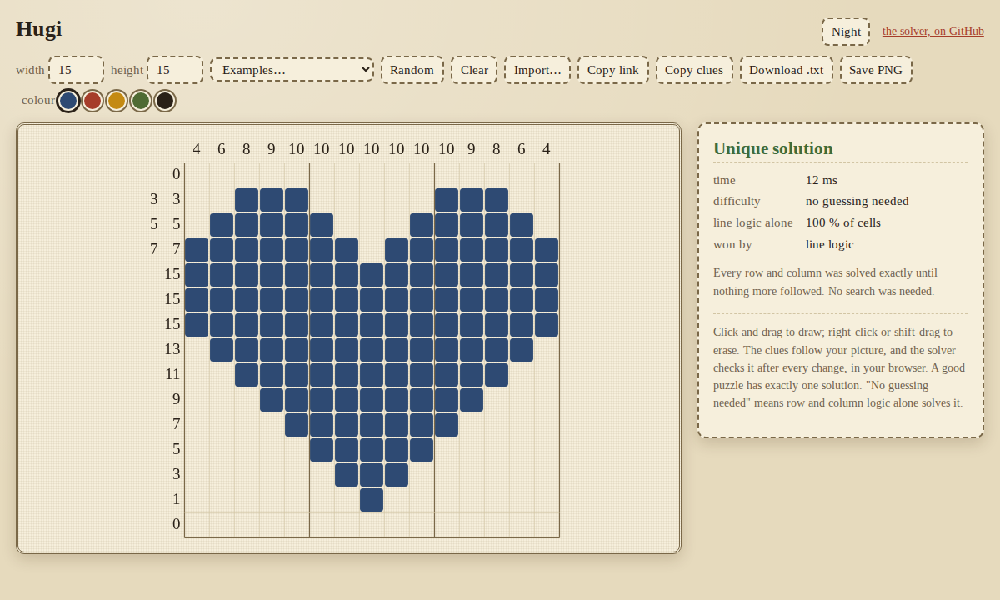
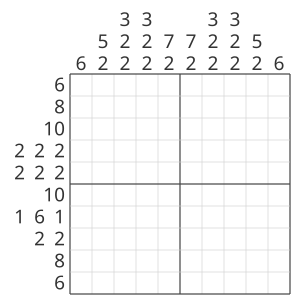
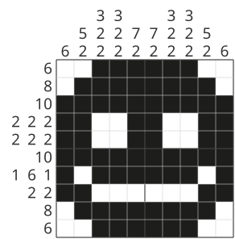
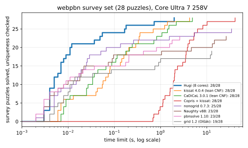
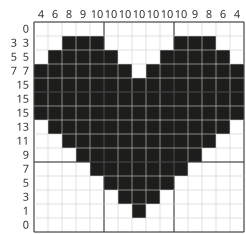
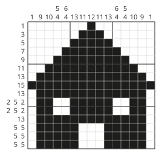
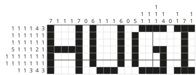
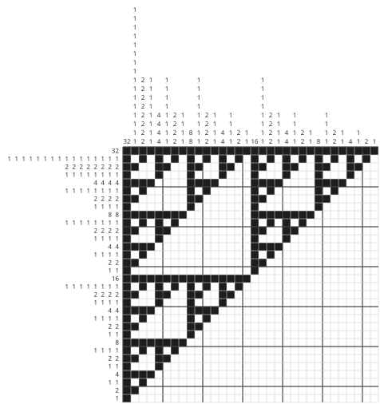
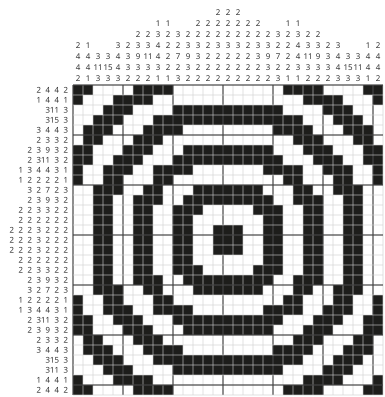
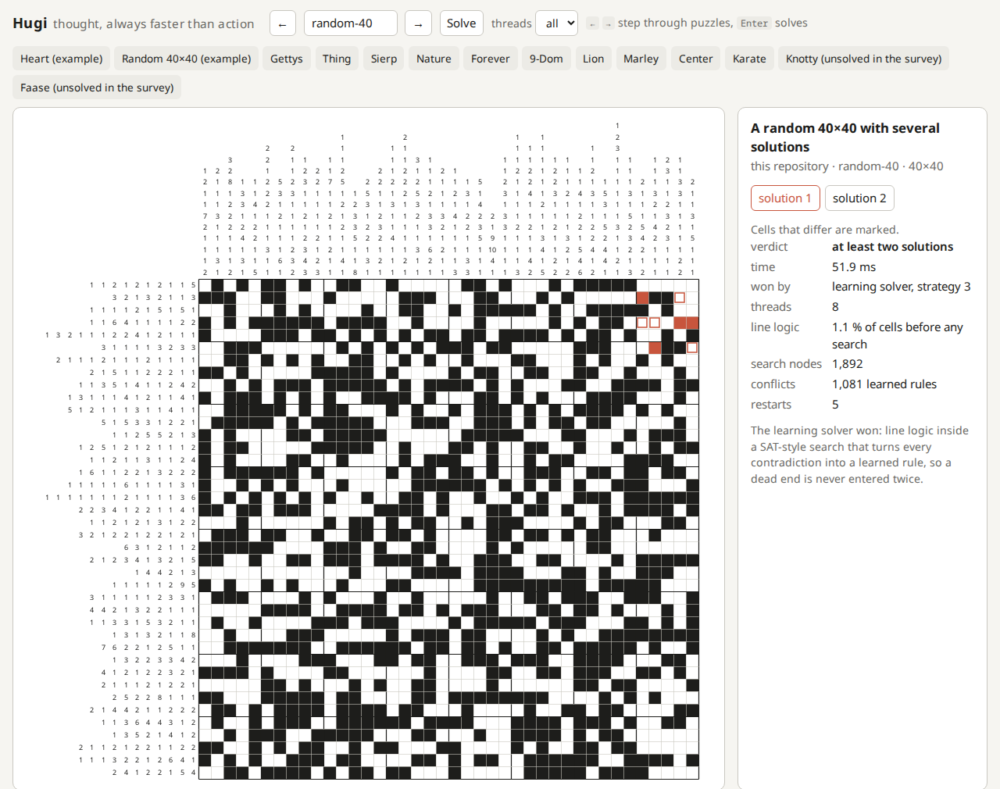

# Hugi

[](https://github.com/meros/hugi/actions/workflows/ci.yml)
[](#license)

**A nonogram solver in Rust: exact line logic, probing and clause learning, racing on every core.**

Hugi solves the two puzzles that no solver in the classic benchmark could finish in 30 minutes,
Knotty in 20 seconds and Faase in two minutes. On the nine hard puzzles of that benchmark it is
first on seven and about 3 times faster than the better of kissat and CaDiCaL on average. It
checks uniqueness: it reports one solution, or that there are at least two.

**[Try it in your browser](https://meros.github.io/hugi/):** draw a puzzle, and Hugi's solver,
compiled to WebAssembly, tells you at once whether it has exactly one solution.

[](https://meros.github.io/hugi/)

## What is a nonogram?

A nonogram (also called picross, griddlers or paint by numbers) is a picture puzzle. The grid
starts empty. The numbers beside each row and above each column say how long each unbroken run
of filled cells is, in order: `2 4 2` means a run of two, then a run of four, then a run of two,
with at least one empty cell between the runs. The solution is the picture that all the clues
agree on.

| The clues | The solution |
|---|---|
|  |  |

You solve one a line at a time. Take a row of 10 cells with the clue `7`. The run can sit in
four places, and four cells are filled in every one of them, so those can be filled at once:

```
clue 7 in 10 cells    ??????????
leftmost placement    ■■■■■■■···
rightmost placement   ···■■■■■■■
filled in both        ···■■■■···
```

Hugi's line solver does this exactly, for every row and column, over and over, and not only for
runs that overlap. In a row of 7 with the clue `1 1` and one cell known to be filled in the
middle, the usual overlap rule finds nothing, but the exact solver sees that the two runs can only
be the known cell and one more, and settles the whole row:

```
clue 1 1, one cell known    ??#?#??    becomes    ··#·#··
```

Easy puzzles, such as the smiley and the heart below, fall to this alone. Harder ones leave cells
undecided, and the solver must try values and backtrack, as a SAT solver does: solving nonograms
is NP-complete (Ueda and Nagao, 1996). A puzzle can also have more than one solution, and a
good solver says so; Hugi always tells you whether the solution is unique.

## Results

Hugi on 8 cores against the best other solver on one core, on the hard puzzles of
[Jan Wolter's survey](https://webpbn.com/survey/):

| puzzle | Hugi | best other solver |
|---|---|---|
| Knotty, 40×40 (unsolved in the survey) | **20 s** | kissat 166 s |
| Faase, 80×95 (unsolved in the survey) | 121 s (98 s with PGO) | kissat 114 s |
| Gettys, webpbn 22336 | **2.0 s** | kissat 4.3 s |
| Sierp, webpbn 12548 | **0.18 s** | kissat 1.4 s |
| Thing, webpbn 18297 | **0.73 s** | kissat 1.2 s |
| Nature, webpbn 9892 | **0.17 s** | kissat 0.69 s |
| 9-Dom, webpbn 8098 | 55 ms | **kissat 40 ms** |
| Forever, webpbn 6574 | 12 ms | **CaDiCaL 9 ms** |



kissat and CaDiCaL run on Hugi's own CNF encoding (`hugi cnf`), the better of the two we tried: it
is up to 4.5 times faster for them than the older one, so they are measured at their best (on the
older encoding kissat needed 427 s for Knotty). Naughty, pbnsolve, nonogrid, grid and Copris are
slower still on the hard puzzles. Every solver checks uniqueness. Hugi's times are medians of 15
runs (3 for Knotty and Faase) from a plain `cargo build --release` on an otherwise idle machine
(Intel Core Ultra 7 258V); a profile-guided build is about 20 % faster on the long puzzles. The
method, versions and every number are in [compare/RESULTS.md](compare/RESULTS.md).

**Where it does not win.** The two smallest of the hard puzzles (9-Dom, Forever) go to kissat and
CaDiCaL by a few milliseconds. On large random puzzles kissat is as good as Hugi or better, and on
the 70×70 and 99×99 random tier it solves 4 of 12 within 60 s where Hugi solves 2. See
[Limits](#limits).

## Try it

    cargo build --release
    ./target/release/hugi puzzles/heart.txt

```
······························
····██████··········██████····
··██████████······██████████··
██████████████··██████████████
██████████████████████████████
██████████████████████████████
██████████████████████████████
··██████████████████████████··
····██████████████████████····
······██████████████████······
········██████████████········
··········██████████··········
············██████············
··············██··············
······························
unique solution
15×15, 0 search nodes, 882.3 µs
```

The build uses `-C target-cpu=native` (`.cargo/config.toml`), so the binary runs only on CPUs
like the one that built it.

### Examples in this repository

Drawn or computed for this repository (`scripts/make_examples.py`), so they are free to use. Run
any of them with `./target/release/hugi puzzles/NAME.txt`.

| | | |
|---|---|---|
|  |  |  |
| `heart`, 15×15: unique, line logic alone | `house`, 15×15: unique, line logic alone | `hugi`, 21×7: unique, one guess |
|  |  | |
| `sierpinski`, 32×32: unique, line logic alone | `rings`, 31×31: several solutions | `smile`, 10×10 (above) and `random-40`, 40×40 (several solutions) |

The benchmark puzzles are copyright their designers, so they are fetched, not included:

    scripts/fetch-webpbn.sh          # the 28 survey puzzles, from webpbn.com
    scripts/fetch-unsolved.sh        # Knotty and Faase
    ./target/release/hugi puzzles/webpbn/22336-gettys.nin

Hugi reads webpbn's `.nin` export, Simpson's `.non` format, and a plain format: a `rows` line,
one clue per row, a `cols` line, one clue per column. Lines are up to 127 cells, black and white.

| command | does |
|---|---|
| `hugi <puzzle>` | solve with all cores, report one solution or at least two |
| `hugi <puzzle> --threads 1` | one thread (the probing search) |
| `hugi <puzzle> --cdcl` | the learning solver alone, with statistics |
| `hugi <puzzle> --json` | the result as JSON, for tools |
| `hugi cnf <puzzle>` | the puzzle as CNF, for any SAT solver |
| `hugi gen W H DENSITY SEED` | a random puzzle |
| `hugi batch <list> --limit-ms N` | many puzzles in one process, with PAR-2 |

For the fastest binary, build with profile-guided optimisation (it needs `llvm-profdata` of the
same LLVM version as `rustc`): `scripts/build-pgo.sh` writes `target-pgo/release/hugi`.

**The web page** (`web/`, live at https://meros.github.io/hugi/) runs the solver in your browser
as WebAssembly: three engines race in Web Workers, and the first answer wins. Draw a picture and
the clues follow; the verdict updates after every change, and when the puzzle has two solutions
the cells where they differ are marked, and **Make unique** finds a one-cell change at a time that
removes the ambiguity (with Undo). **Import** reads clues (Hugi, webpbn `.nin`, `.non`), a picture
drawn with `#` and `.`, or an image (PNG, JPEG, GIF, WebP) that it shrinks to a grid you can adjust;
you can also drop a file on the page or paste an image. Puzzles are shared as a link and exported as
clues or a PNG. To build it yourself: `web/build.sh`, then serve `web/` with any static
file server.

**The local UI** (`ui/hugi_ui.py`, Python 3 and a built `hugi`) fetches webpbn puzzles by number,
solves them with all cores and shows how: the engine, the time, the conflicts.

    python3 ui/hugi_ui.py



Type a webpbn number or click one of the quick links to the hard puzzles; ← and → step through
puzzle numbers.

## How it works

Hugi runs several kinds of engine at once and takes the first answer.

**Line solver.** Each row and column is two bit masks on one machine word (`u64` up to 63 cells,
`u128` up to 127): cells known filled and cells known empty. A backward and a forward pass over
the blocks, with Kogge-Stone fills over the word, find every cell that all placements of the
clue agree on. That is exact, not an overlap heuristic, and costs a few dozen instructions per
block. A per-thread cache answers the 80-88 % of line states that come back.

**Probing search.** Before every branch it tries both values of every open cell, each with full
propagation. A value that fails forces the other; cells both values agree on are forced too. A
probe is skipped when none of the lines it touched has changed since it last ran, so the search
tree stays exactly the same and gets cheaper. It branches on the cell whose two values settle the
most cells, splits the open cells into independent parts when they fall apart, and hands
branches to idle threads.

**Learning solver.** Lazy clause generation: the line solver works as a propagator inside a
CDCL search, as in modern SAT solvers. When a line forces a cell, it records only that it did;
the reason is worked out if a contradiction later needs it, as the smallest set of known cells
that still forces it. Contradictions become learned clauses (first unique implication point,
recursive minimisation), so a dead end found once is never entered again anywhere in the search.
It chooses cells by conflict activity, follows the longest conflict-free assignment seen ("target
phases"), and restarts often. A second strategy adds block-position variables to the search, so
that learned clauses can say where a block starts, not only which cells are filled. It uses an
order encoding without auxiliary cover variables, which halved its propagation work, and it
shortens what it learns as kissat and CaDiCaL do: several literals of one decision level become
the one that implies them all (shrinking), and learned clauses are tested again by propagation
and trimmed (vivification).

**Portfolio.** Four learning threads and the probing search start together: the learning solver
with block-position variables, the one with cells only, and two differently seeded copies of the
first, which retire after 3 s so that the long-running engines keep their clock speed. The
probing search takes the other cores. Cells proven to hold in every solution are shared between
all of them. Different puzzles are won by different engines, and the same strategy with another
seed can be 20 times faster on one puzzle, which is what the extra seeds are for.

Every choice above was measured before it was kept. [docs/experiments.md](docs/experiments.md)
records what was tried, the numbers, and the many things that did not help: about forty
experiments, of which more than half were dropped or left as off-by-default settings.

## Limits

- **Large random puzzles.** On 20 random 50×50 and 60×60 puzzles at 50 % density, kissat needs
  44 s in total on one core, each within 9 s. Hugi's default portfolio on 8 cores solves all 20
  but needs about 45 s per process in total: the cores do not help on this class. Hugi's best
  single engine (the learning solver with block-position variables) on one core needs 31 s and is
  faster on 17 of the 20; kissat is ahead on three.
- **Faase.** kissat on one core solves it in 114 s on Hugi's encoding; Hugi takes 121 s (98 s
  with PGO) on 8 cores.
- **The frontier.** At 70×70 and 99×99 random puzzles at 50 %, kissat solves 4 of 12 within 60 s
  (3, 35, 54 and 50 s) and Hugi 2 (2 s and 40 s). That size is hard for every solver we tried.
- Black-and-white puzzles only, lines up to 127 cells.
- Results on 8 cores vary between runs, since threads race; the benchmark numbers are medians.

## The name

In the Prose Edda, Thor and his companions visit the giant Útgarða-Loki and are challenged to
contests. Þjálfi, the fastest runner among them, races a small, unknown figure called Hugi and
loses three times; in the first race Hugi reaches the end and comes back to meet him. Afterwards
Útgarða-Loki explains: Þjálfi had raced against thought, which is always faster than action.
*Hugi* is Old Norse for "thought".

## How it was built

Hugi was written in two days (8-9 October 2026) by one developer working with Claude, Anthropic's
AI model, in Claude Code. The rules were set by the human: measure everything, keep nothing that
does not win, publish the losses next to the wins. Claude wrote the code, ran the experiments and
read the papers; the human chose the direction and decided what to keep. Every decision has its
numbers in [docs/experiments.md](docs/experiments.md), and the benchmark scripts and raw data
are in [compare/](compare/).

## Credits

The puzzles are the work of their designers, credited in `puzzles/survey.list` and
`scripts/fetch-unsolved.sh`. Jan Wolter's survey of paint-by-number solvers and webpbn.com made
the benchmark possible. Thanks to the authors of the solvers compared here for publishing their
code: Naughty (Wu), pbnsolve (Wolter), nonogrid (tsionyx), grid (Olšák), Copris, kissat and
CaDiCaL (Biere and others). The papers that shaped the engines are listed in
[docs/experiments.md](docs/experiments.md#reading-list).

## License

Licensed under either of [Apache License, Version 2.0](LICENSE-APACHE) or [MIT license](LICENSE-MIT)
at your option.
